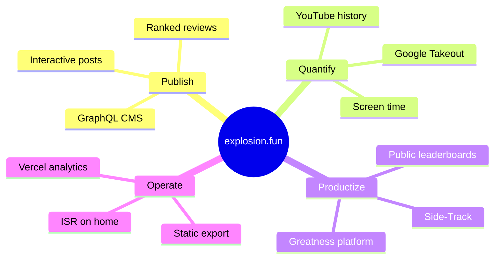
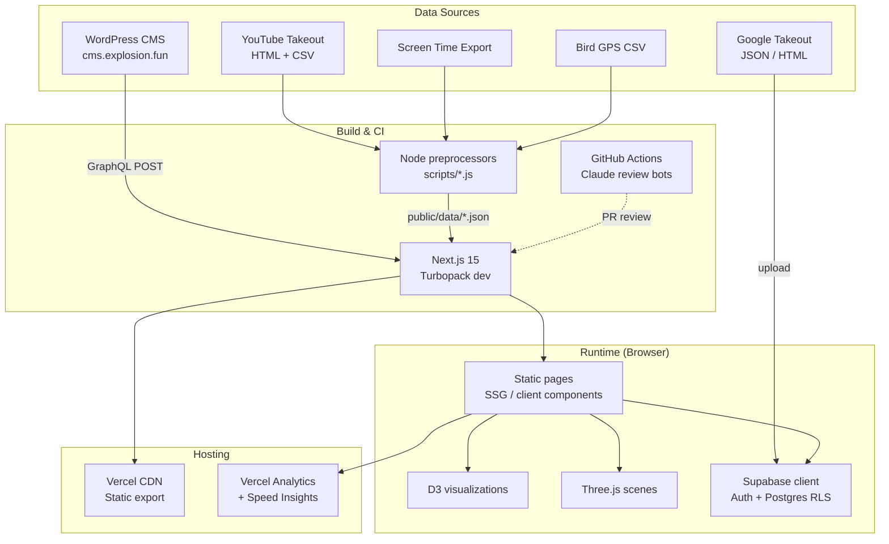
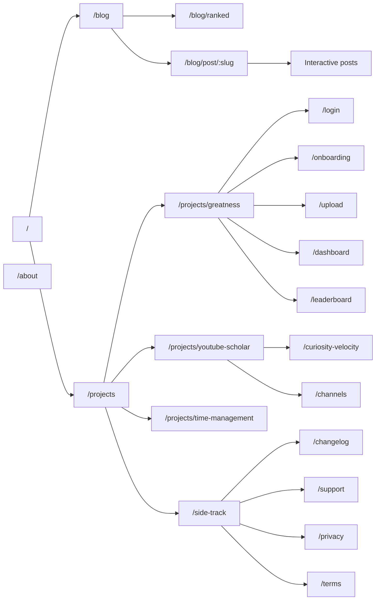
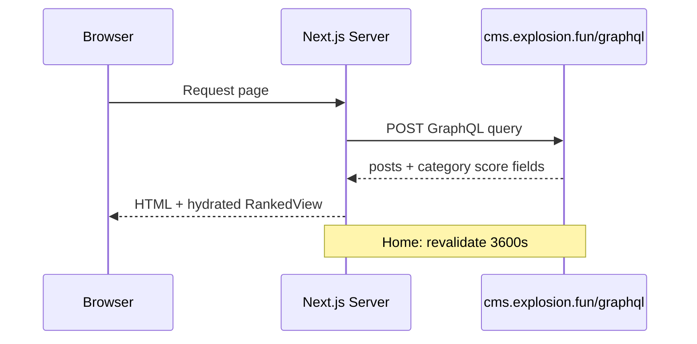
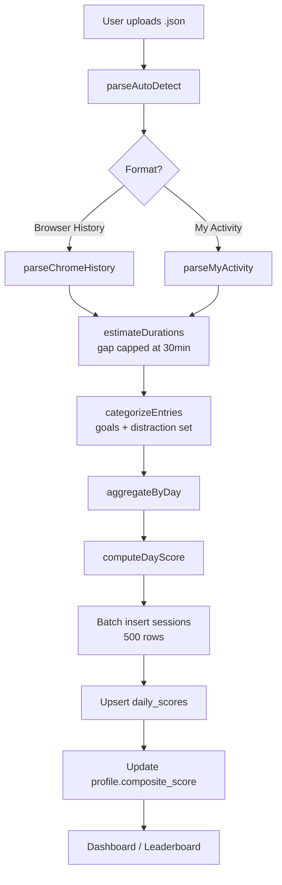
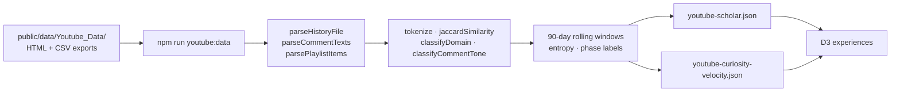
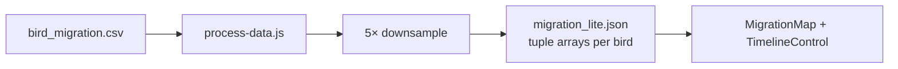
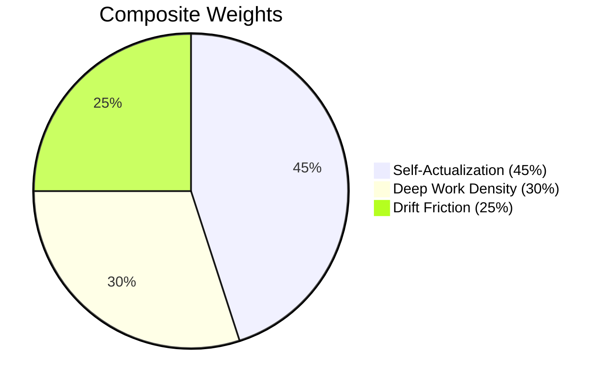
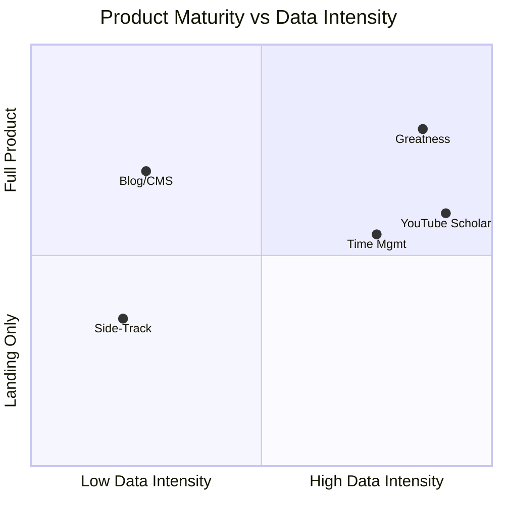
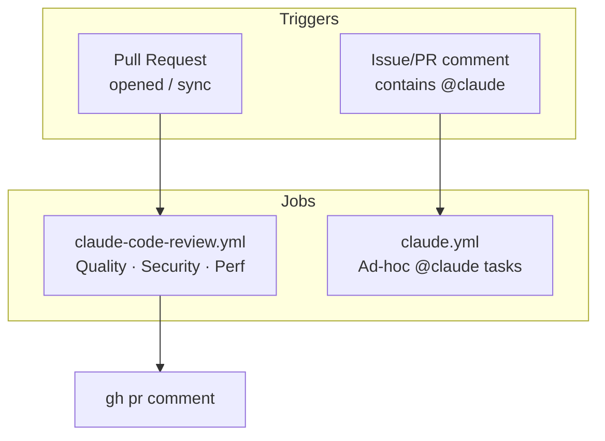

<div align="center">

# explosion.fun

### *The Blog of a Curious Mind — and the lab where personal data becomes insight*

[](https://nextjs.org/)
[](https://react.dev/)
[](https://d3js.org/)
[](https://supabase.com/)
[](https://vercel.com/)

[Live site](https://explosion.fun) · [CMS GraphQL](https://cms.explosion.fun/graphql) · [Projects](/projects)

</div>

---

## Purpose & What We Are Building

**explosion.fun** is a personal publishing platform and **quantified-self product studio**. It combines:

1. **A ranked media-review blog** — anime, manga, movies, TV, and books scored through a structured rubric, powered by a headless WordPress GraphQL CMS.
2. **Interactive long-form essays** — 3D visualizations, D3 data stories, and narrative case studies that turn raw exports (YouTube Takeout, screen time, bird telemetry) into portfolio-grade artifacts.
3. **Shippable mini-products** — **Greatness** (self-actualization scoring from browsing history), **Side-Track** (workout companion landing), and analytics dashboards that encode real behavioral change.

The north star is not vanity metrics. It is **turning opaque digital exhaust into actionable self-knowledge** — then packaging that knowledge so it reads as credible, hireable, and monetizable work (portfolio, product surface, future SaaS).



---

## Efficiency Gains & Profit Motive

| Lever | Mechanism | Gain |
|-------|-----------|------|
| **Static export** | `output: 'export'` — prebuilt HTML/JS, no Node at the edge | Near-zero hosting cost, fast global CDN, predictable builds |
| **Build-time data** | YouTube / bird / time-mgmt JSON produced offline via Node scripts | Runtime stays O(1) — charts read pre-aggregated JSON, not raw Takeout |
| **Client-side Takeout parsing** | Greatness parses JSON in-browser before batched Supabase writes | Privacy posture + no heavy upload API; user owns raw file |
| **Downsampling** | Bird migration: 1-in-5 GPS points + compact tuple arrays | ~80% smaller payloads for smooth D3 maps |
| **GraphQL field pruning** | Category-specific score fragments only when needed | Smaller post payloads on detail pages |
| **Home ISR** | `revalidate: 3600` on CMS fetch | Fresh blog index without rebuilding entire site hourly |

**Profit motive (explicit):**

- **Greatness** is architected as an open platform with public leaderboards — a path to freemium analytics, coaching integrations, or B2B “focus intelligence” for teams.
- **YouTube Scholar** and **Time Management** dashboards function as **proof-of-work** for data-engineering and product sense.
- **Side-Track** is a product shell (changelog, legal, support) ready for app-store or subscription monetization.
- The blog + projects loop drives **inbound attention**; ranked reviews and interactive posts increase time-on-site and shareability without paid acquisition.

---

## System Architecture



### Design Practices in This Repo

| Practice | Where it shows up |
|----------|-------------------|
| **Jamstack / static-first** | `next.config.js` → `output: 'export'`, unoptimized images for export compatibility |
| **Separation of compute** | Heavy parsing in `scripts/`; interactive UI consumes JSON artifacts |
| **Headless CMS** | All blog content from GraphQL; front-end owns presentation |
| **Row-level security** | Supabase `profiles`, `goals`, `browsing_sessions`, `daily_scores` with RLS policies |
| **Progressive enhancement** | Server components for SEO on blog; `'use client'` only for charts/auth |
| **Convention-based routing** | App Router file-system routes under `src/app/` |
| **Batch persistence** | Greatness upload inserts sessions in chunks of 500 |
| **Observability** | `@vercel/analytics` + `@vercel/speed-insights` on key pages |

---

## Technology Stack

### Core

| Layer | Technology | Role |
|-------|------------|------|
| Framework | **Next.js 15.3** (App Router) | Routing, RSC, static export |
| UI | **React 19** | Components, hooks, client islands |
| Styling | **CSS Modules** + **Geist** fonts | Scoped styles, typography |
| Language | **JavaScript** (+ TypeScript in devDeps) | App code; `jsconfig` path aliases (`@/`) |

### Data & Backend

| Technology | Role |
|------------|------|
| **WordPress + WPGraphQL** (`cms.explosion.fun`) | Blog posts, categories, multi-rubric scores |
| **Supabase** (`@supabase/supabase-js`) | Greatness auth, profiles, goals, sessions, leaderboard |
| **Firebase** (dependency) | Listed for portfolio / future mobile; not wired in `src/` today |

### Visualization & Media

| Library | Used in |
|---------|---------|
| **D3.js v7** | YouTube Scholar, Curiosity Velocity, Time Management, bird map |
| **Three.js** | Interactive solar-system blog post |
| **topojson-client** | Bird migration world map |
| **ResizeObserver** | Responsive chart sizing |

### Tooling & Ops

| Tool | Role |
|------|------|
| **Turbopack** | `next dev --turbopack` |
| **ESLint 9** + `eslint-config-next` | Linting |
| **GitHub Actions** | Claude Code on `@claude` mentions; automated PR review |
| **Vercel** | Analytics, Speed Insights, static hosting |

---

## Site Map — All Routes



### Route Reference

| Path | Type | Description |
|------|------|-------------|
| `/` | Server | Hero + ranked reviews from CMS (1h revalidate) |
| `/about` | Static | About page |
| `/blog` | Static | Blog index |
| `/blog/ranked` | Static | Ranked list view |
| `/blog/post/[slug]` | Dynamic | CMS post by slug + category-specific scores |
| `/blog/post/interactive/solar-system` | Client | Three.js orbital sim |
| `/blog/post/interactive/bird-migration` | Client | D3 + TopoJSON migration map |
| `/blog/post/interactive/ceo-affair` | Static | Interactive narrative |
| `/projects` | Static | Project hub cards |
| `/projects/greatness` | Client | Product landing |
| `/projects/greatness/login` | Client | Supabase email auth |
| `/projects/greatness/onboarding` | Client | Goal definition (domains + keywords) |
| `/projects/greatness/upload` | Client | Takeout ingest + score pipeline |
| `/projects/greatness/dashboard` | Client | Personal metrics |
| `/projects/greatness/leaderboard` | Client | Public composite rankings |
| `/projects/time-management` | Client | 31-day screen-time D3 dashboard |
| `/projects/youtube-scholar` | Client | YouTube Takeout case study |
| `/projects/youtube-scholar/curiosity-velocity` | Client | Ribbon timeline + phase model |
| `/projects/youtube-scholar/channels` | Client | Channel-level breakdown |
| `/side-track` | Static | Workout app product page |
| `/side-track/changelog` | Static | Release notes (CMS category `Side-Track`) |
| `/side-track/support` | Static | Support |
| `/side-track/privacy` | Static | Privacy policy |
| `/side-track/terms` | Static | Terms of service |

---

## Data Pipelines

### Pipeline A — Blog (WordPress → Next.js)



### Pipeline B — Greatness (Takeout → Scores → Supabase)



### Pipeline C — YouTube Scholar (offline)



### Pipeline D — Bird Migration (offline)



### Pipeline E — Time Management (offline analysis)

Screen-time export → Python/analysis (documented in `public/data/time-management/`) → `analysis.json` → `TimeManagementDashboard` (12+ D3 chart types: circadian, stickiness, willpower curve, YouTube topic breakdown).

---

## Algorithms

### 1. Greatness Score (`src/utils/greatnessScore.js`)

Composite daily score from three weighted pillars:



| Metric | Formula / Logic |
|--------|-----------------|
| **Self-Actualization Ratio** | `goalTime / (goalTime + distractionTime) × 100` |
| **Deep Work Density** | Sort goal sessions by time; merge blocks with gaps ≤ **5 min**; count blocks ≥ **25 min** (1500s); ratio of deep-work seconds to total goal time (cap 100%) |
| **Drift Friction** | Among transitions within **30 min**, count goal→non-goal switches; `max(0, (1 − drifts/transitions) × 100)` |
| **Composite** | `0.45×SA + 0.30×DW + 0.25×DF` |
| **Trend** | If ≥14 days: avg composite of last 7 days minus prior 7 |

**Takeout parsing** (`src/utils/takeoutParser.js`):

- Duration estimation: inter-visit gap, capped at **1800s**; last entry defaults to **60s**
- Goal matching: domain list OR keyword in title/domain
- Distractions: curated domain set (YouTube, Reddit, anime sites, etc.)

### 2. Media Review Scoring (`src/utils/scores.js`)

- Pick rubric fields by primary category (anime, manga, movies, tv-series, books-fiction, books-non-fiction)
- **Average score** = mean of all numeric ACF fields (excluding `ageRestricted`, `fieldGroupName`)
- Home **RankedView** filters and sorts by category tab

### 3. YouTube Domain Classification (`scripts/process-youtube-data.js`)

- **Keyword taxonomy**: 7 curated domains (engineering, geopolitics, AI, etc.) with `matchesKeyword` (word-boundary regex for single tokens)
- **Jaccard similarity** on token sets for search-query clustering / novelty
- **Comment tone**: heuristic `classifyCommentTone` → analytical | affirming | skeptical | deadpan

### 4. Curiosity Velocity / Phase Detection

Rolling **90-day** windows on watch history (minimum 18 events, 10 classified):

| Signal | Computation |
|--------|-------------|
| **Focus share** | Dominant topic count / classified total |
| **Entropy** | Normalized Shannon entropy over topic distribution |
| **Switch rate** | Topic changes / adjacent events |
| **Phase labels** | Rules: `pivot`, `return`, `deep_dive`, `narrowing`, `broad_exploration`, `balanced` |
| **Scores** | `deepDiveScore`, `explorationScore`, `exploitationScore` from weighted combinations |

### 5. Bird Migration Optimization

- CSV parse → group by bird → sort by timestamp
- **Downsample**: keep every 5th point
- Store as `[timestamp, altitude, lat, lon, speed]` tuples for smaller JSON

### 6. Time Management Analytics (client D3)

Precomputed `analysis.json` drives charts for: hourly activity stacks, category donuts, circadian rhythm, session duration distributions, domain stickiness, late-night drift, and willpower decay curves.

---

## Project Deep Dives



### Greatness Platform

- **Auth**: Supabase email/password; auto-profile trigger on signup
- **Schema**: `profiles`, `goals`, `browsing_sessions`, `daily_scores` + RLS
- **Privacy story**: Raw Takeout parsed client-side; structured rows persisted in batches
- **Social**: Opt-in `is_public` profiles; leaderboard index on `composite_score`

### YouTube Scholar

Turns ~67k watch events and ~5.5k searches into a narrative “Chief Information Aggregator” portfolio piece — domain taxonomy, heatmaps, subscription retention, comment tone analysis.

### Time Management

31 days · 418.7 hours tracked — reframes “web browsing” into YouTube vs coding vs AI-tool ratios; actionable schedule recommendations in the analysis report.

### Side-Track

Workout tracking companion — marketing surface with changelog fed from CMS `Side-Track` category posts.

---

## CI / Post Pipelines



| Workflow | Trigger | Action |
|----------|---------|--------|
| `claude-code-review.yml` | PR open/sync | Automated review → PR comment |
| `claude.yml` | `@claude` in issues/PR comments | Claude Code action with repo checkout |

**Local preprocess commands:**

```bash
npm run youtube:data    # Regenerate YouTube JSON artifacts
node scripts/process-data.js   # Bird migration lite JSON
```

---

## Repository Layout

```
explosion.fun/
├── src/
│   ├── app/                 # App Router pages
│   ├── components/          # UI, D3 experiences, Greatness nav/auth
│   ├── config/              # GraphQL, Supabase client
│   └── utils/               # Scores, Takeout parser, Greatness algorithms
├── public/data/             # Prebuilt JSON + Takeout raw (local)
├── scripts/                 # Offline data processors
├── supabase/schema.sql      # Greatness DB + RLS
└── .github/workflows/       # Claude CI bots
```

---

## Getting Started

### Prerequisites

- Node.js 18+
- Optional: Supabase project (for Greatness) — set `NEXT_PUBLIC_SUPABASE_URL` and `NEXT_PUBLIC_SUPABASE_ANON_KEY`

### Development

```bash
npm install
npm run dev
```

Open [http://localhost:3000](http://localhost:3000).

### Production build (static export)

```bash
npm run build    # Outputs static site to out/
npm run start    # Serves export locally
```

### Greatness database setup

Run `supabase/schema.sql` in the Supabase SQL editor to create tables, RLS policies, and the `handle_new_user` trigger.

---

## Environment Variables

| Variable | Required for | Description |
|----------|--------------|-------------|
| `NEXT_PUBLIC_SUPABASE_URL` | Greatness | Supabase project URL |
| `NEXT_PUBLIC_SUPABASE_ANON_KEY` | Greatness | Anon/public API key |
| `CLAUDE_CODE_OAUTH_TOKEN` | CI only | GitHub Actions secret for Claude bots |

CMS endpoint is hardcoded: `https://cms.explosion.fun/graphql`.

---

## Salient Notes

- **Static export constraint**: No Next.js API routes or server actions at deploy time — Greatness and all interactivity are client-side or external (Supabase, CMS).
- **Dual content strategy**: Editorial (blog) + quantitative (projects) reinforces the same personal brand.
- **Greatness is the only live mutable backend** in-repo; everything else is immutable JSON or headless CMS.
- **Firebase** remains a dependency for future mobile/Side-Track integration but is not imported in application source today.
- **Interactive posts** demonstrate range: Three.js (spatial), D3 (temporal/statistical), narrative (CEO affair).

---

## License

No explicit LICENSE file in this repository. Assume all rights reserved unless otherwise stated.

---

<div align="center">

*Built to measure what matters, publish what resonates, and productize what scales.*

**explosion.fun** — curiosity, quantified.

<br /><br />

Built with curiosity by [Reuben Roy](https://github.com/reuben-roy).

</div>
